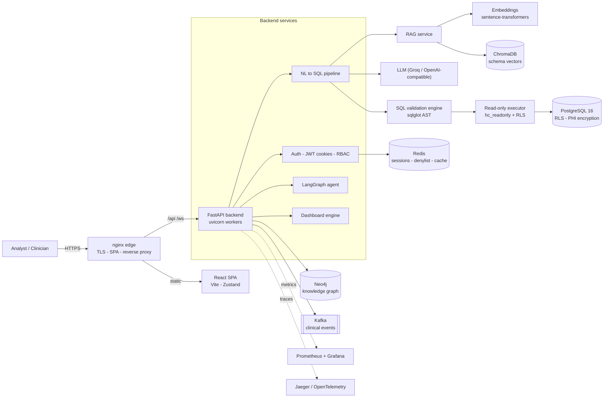

# 🏥 Healthcare Copilot — RAG Data Analyst

> An AI copilot that turns natural-language clinical questions into **safe,
> validated, read-only SQL**, executes it against a healthcare data warehouse,
> and returns charts, dashboards, and narrative insights — with HIPAA-minded
> security at every layer.

<p align="left">


</p>

---

## ✨ What it does

Ask *"What's the 30-day readmission rate by department for the last 6 months?"* and the system:

1. Classifies intent (chit-chat vs. clinical query).
2. Retrieves the relevant schema via **RAG** (HyDE → embeddings → ChromaDB).
3. Generates PostgreSQL with an LLM — directly or via a **LangGraph multi-agent**
   pipeline (plan → generate → validate → optimize).
4. **Validates** the SQL (sqlglot AST: allow-list, injection guard, complexity, LIMIT).
5. Executes it through a **least-privilege, read-only DB role** under **Row-Level Security**.
6. **Redacts PHI** by role, recommends a chart, and writes an AI insight summary.
7. Streams progress over **Server-Sent Events / WebSockets**.

## 🔐 Security highlights (why this isn't a toy)

- **Read-only execution isolation** — AI-generated SQL runs as `hc_readonly`
  (SELECT-only, RLS-enforced), never the app's write role.
- **PostgreSQL Row-Level Security** with role-based policies (doctor / nurse /
  analyst / admin) and a trusted-backend bypass for migrations/seeding.
- **SQL safety engine** — AST allow-list, stacked-statement / tautology / system-catalog
  blocking, complexity scoring, mandatory `LIMIT`, optimizer-output re-validation.
- **Auth** — PyJWT, **HttpOnly + SameSite + Secure cookies** (no tokens in JS),
  refresh-token rotation, Redis revocation denylist, per-IP rate limiting.
- **PHI encryption at rest** — Fernet (with key rotation) via a transparent
  SQLAlchemy type; **PHI redaction** on every egress path.
- **Defense in depth** — global security headers (CSP/HSTS/…), prompt-injection
  heuristics, audit logging, and secret scanning in CI.

See **[docs/ARCHITECTURE.md](docs/ARCHITECTURE.md)** for full diagrams and
**[docs/PRODUCTION_READINESS.md](docs/PRODUCTION_READINESS.md)** for the security scorecard.

## 🧱 System architecture



## 🛠️ Tech stack

| Layer | Technology |
|---|---|
| Frontend | React 18, Vite, Zustand, React Query, Recharts, nginx |
| Backend | FastAPI, async SQLAlchemy 2, Pydantic v2, uvicorn |
| AI / RAG | LangGraph, LangChain, sentence-transformers, ChromaDB, HyDE |
| Data | PostgreSQL 16 (RLS), Redis, Neo4j, Kafka |
| Security | PyJWT, passlib/bcrypt, Fernet (cryptography), sqlglot, detect-secrets |
| Observability | Prometheus, Grafana, Jaeger, OpenTelemetry, structlog |
| Infra / CI | Docker, docker-compose, Alembic, GitHub Actions, Locust |

## 📁 Repository layout

```
healthcare-copilot/
├── backend/                 # FastAPI app, services, models, migrations, tests
│   ├── app/
│   │   ├── api/             # REST + WebSocket routes
│   │   ├── services/        # RAG, text-to-SQL, agentic, validation, dashboards…
│   │   ├── core/            # security, encryption, cookies, rate-limit, telemetry
│   │   ├── db/              # models, sessions (primary + read-only), RLS startup checks
│   │   └── middleware/      # security headers, audit logging
│   ├── alembic/             # schema + RLS + index + encryption migrations
│   ├── loadtest/            # Locust suite (100/500/1000 users)
│   ├── scripts/             # backup, SQL role provisioning, entrypoint
│   └── tests/               # unit · security (red-team) · integration (RLS)
├── frontend/                # React SPA + production nginx image
├── deploy/nginx/            # self-managed TLS reverse-proxy config
├── docs/                    # architecture, deployment, DR, secret rotation, readiness
└── docker-compose*.yml      # dev + production compositions
```

## 🚀 Quick start (local dev)

```bash
# Backend
cd backend
cp .env.example .env                 # CHROMADB_MODE=ephemeral works with no Docker
python -m venv .venv && . .venv/Scripts/activate   # (Linux/macOS: source .venv/bin/activate)
pip install -r requirements.txt
alembic upgrade head
python -m app.scripts.seed_db        # demo users + synthetic clinical data
uvicorn app.main:app --reload --port 8001

# Frontend
cd ../frontend && npm install && npm run dev   # http://localhost:5173
```

Production (single VM): `docker compose -f docker-compose.prod.yml up -d --build`
— see **[docs/DEPLOYMENT.md](docs/DEPLOYMENT.md)** (AWS, Azure, sizing, costs, scaling).

## ✅ Quality & testing

```bash
pytest tests/unit tests/security        # 74 unit + red-team tests
pytest tests/integration                # RLS + read-only isolation (needs Postgres)
black --check app && bandit -r app -ll  # format + SAST (0 medium/high)
```
CI (GitHub Actions) runs: secret scanning, lint/format, Bandit SAST, dependency
audit, unit + security tests, and a Postgres-backed RLS integration job.

## 📚 Documentation
- [Architecture & flows (10 Mermaid diagrams)](docs/ARCHITECTURE.md)
- [Deployment guide (AWS / Azure / costs / scaling)](docs/DEPLOYMENT.md)
- [Production readiness report](docs/PRODUCTION_READINESS.md)
- [Disaster recovery](docs/DISASTER_RECOVERY.md)
- [Secret rotation runbook](docs/SECRET_ROTATION.md)

> ⚕️ Clinical data in this repo is **synthetic**. Deploy on HIPAA-eligible infra
> with a signed BAA before handling real PHI.
