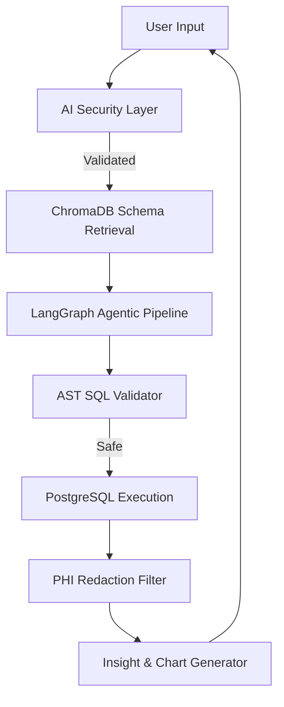

# Healthcare Copilot

Healthcare Copilot is an enterprise-grade analytical engine designed to translate natural language inquiries into secure, executable SQL queries against a structured healthcare database. The system utilizes a multi-agent orchestration layer, retrieval-augmented generation (RAG), and a supplemental knowledge graph to assist analysts in extracting clinical data securely while maintaining strict compliance with healthcare data regulations.

## 1. System Architecture

The application is distributed across a React-based frontend and a Python FastAPI backend, orchestrated via Docker.

### 1.1 Infrastructure Components
- **Application Server**: FastAPI running via Uvicorn.
- **Relational Database**: PostgreSQL 16 (stores structured OLAP clinical data).
- **Vector Database**: ChromaDB (stores embeddings of database schema definitions for retrieval).
- **Knowledge Graph**: Neo4j (stores explicit relationships between clinical entities for graph traversal).
- **In-Memory Cache**: Redis 7 (manages session state, conversation history, and rate limiting).
- **Observability Stack**: Prometheus (metrics scraping), Jaeger (distributed tracing), and Grafana (visualization).

### 1.2 Pipeline Workflow


## 2. Core Functional Modules

### 2.1 Natural Language to SQL Processing (RAG)
The translation of natural language to SQL relies on Retrieval-Augmented Generation. Upon receiving a query, the system vectorizes the input using the `sentence-transformers/all-MiniLM-L6-v2` embedding model. It queries ChromaDB to retrieve the most semantically relevant database schemas and Table Data Definition Language (DDL) statements. This context is injected into the prompt of the Large Language Model to ensure syntactical and structural accuracy of the generated SQL.

### 2.2 Agentic Workflow Execution
Complex queries bypass the standard pipeline and are routed to a LangGraph-based multi-agent architecture. This system models the workflow as a state graph with the following sequential nodes:
1. **Schema Extraction**: Identifies required tables.
2. **Query Planning**: Outlines the logical steps required to answer the prompt.
3. **SQL Generation**: Drafts the initial SQL query.
4. **Validation**: Ensures the query is syntactically valid and executes without failure.
5. **Optimization**: Executes a PostgreSQL `EXPLAIN (FORMAT JSON)` on the draft query. An optimization agent analyzes the query cost, sequential scans, and execution plan to rewrite the query or recommend optimal `CREATE INDEX` commands.

### 2.3 AI Security and Compliance Layer (HIPAA Enforcement)
The system enforces strict security boundaries designed for protected health environments:

- **Ingress Filtering (Prompt Injection)**: Before processing, heuristic patterns scan user inputs to detect jailbreak attempts, system prompt overrides, or destructive commands (e.g., `drop table`).
- **Abstract Syntax Tree (AST) Guardrails**: Prior to database execution, the generated SQL is parsed using `sqlglot`. The validation engine actively rejects Data Manipulation Language (DML) and Data Definition Language (DDL). It strictly enforces `SELECT` operations, blocks system catalog access (`pg_catalog`), and checks against tautology-based SQL injections (e.g., `1=1`).
- **Egress Filtering (PHI Redaction)**: Database result sets pass through a redaction engine before reaching the client. Based on Role-Based Access Control (RBAC), if the requesting user possesses an `analyst` role, all fields containing Protected Health Information (PHI)—such as Medical Record Numbers (MRN), Social Security Numbers (SSN), names, and contact details—are automatically masked.
- **Audit Logging**: All queries, validation violations, and security events are logged with structured metadata, tagged explicitly for HIPAA audit aggregation.

### 2.4 Data Visualization and Insights Engine
Following query execution, the structured result set is evaluated by a Chart Advisor service. The service inspects data types and column counts to heuristically determine the optimal visualization format (e.g., assigning continuous time-series data to line charts, categorical aggregations to bar or pie charts). Concurrently, an Insight Engine analyzes the statistical variance within the data to return a text-based analytical summary.

### 2.5 Knowledge Graph Integration
To supplement relational queries, the system synchronizes core clinical entities (Patients, Providers, Encounters, Diagnoses) into a Neo4j Knowledge Graph. This allows the system to perform complex relationship traversals, such as identifying shared patient encounters among networks of providers, which are computationally expensive via standard relational `JOIN` operations.

## 3. Database Schema Overview

The underlying PostgreSQL database represents a standard healthcare OLAP schema, utilizing UUID primary keys and extensive foreign key relationships. Primary domains include:
- **Reference Data**: `Facilities`, `Departments`, `Providers`.
- **Core Clinical Data**: `Patients`, `Encounters`.
- **Clinical Events**: `Diagnoses`, `Procedures`, `Medications`, `Lab_Results`, `Vital_Signs`.
- **Financial Data**: `Claims`.

## 4. Local Deployment Instructions

The application requires Docker and Docker Compose.

1. Clone the repository and navigate to the project root.
2. Initialize the environment:
   ```bash
   docker compose up --build -d
   ```
3. Wait for the containers to reach a healthy state. Verify logs using:
   ```bash
   docker compose logs -f backend
   ```
4. Access the respective services via their exposed ports:
   - Client Interface (Frontend): `http://localhost:5173`
   - API Documentation (Swagger): `http://localhost:8001/docs`
   - Neo4j Graph Browser: `http://localhost:7474`
   - Observability Dashboard: `http://localhost:3000`
