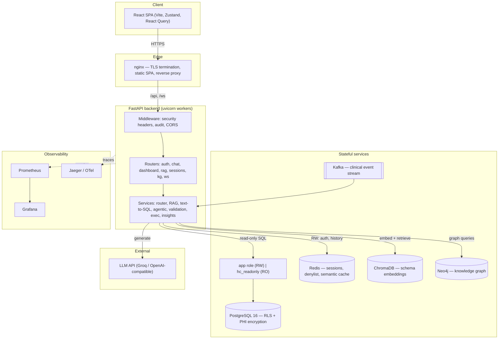
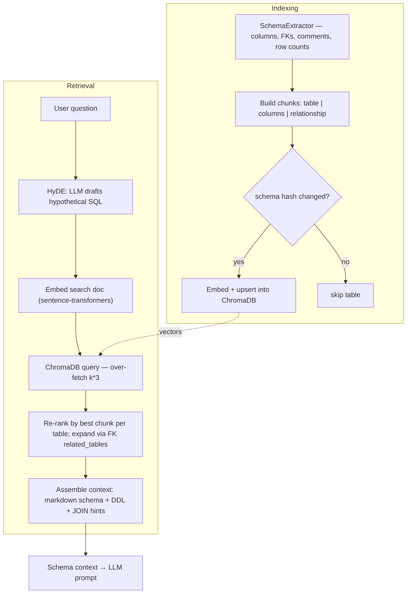
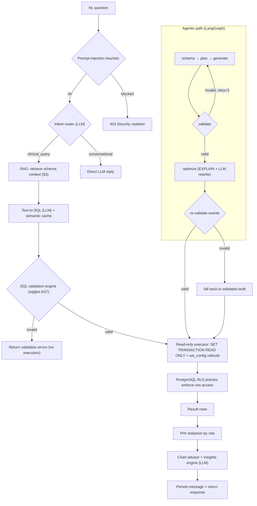
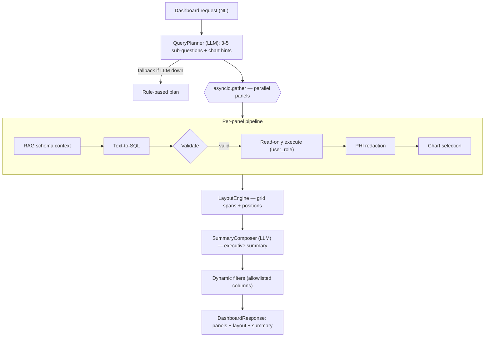
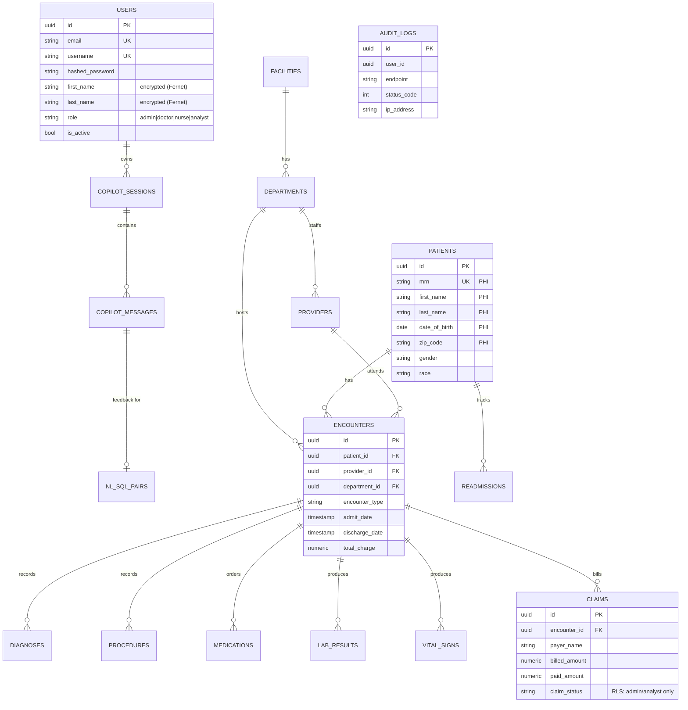
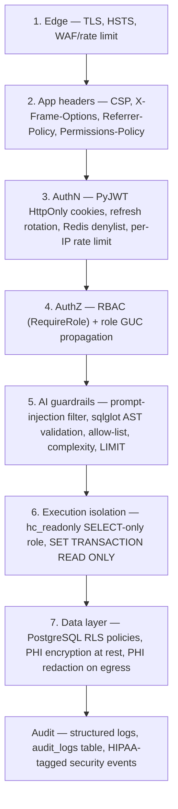
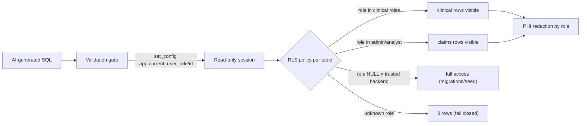
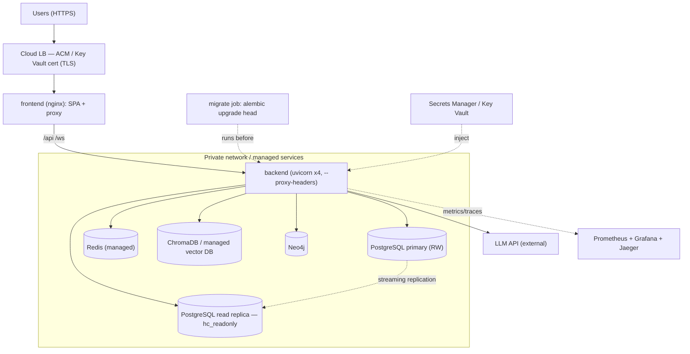
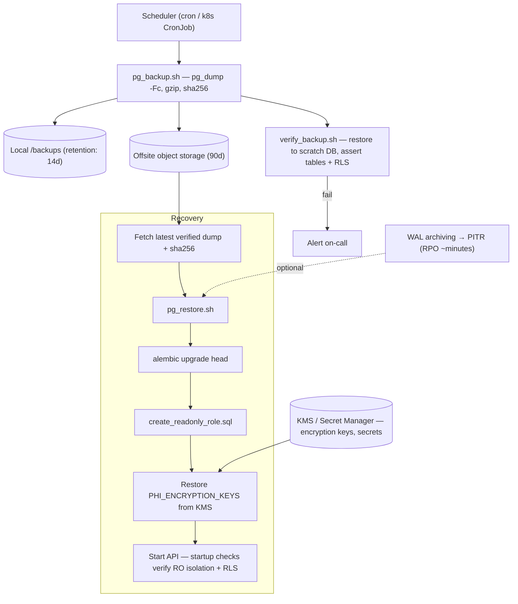
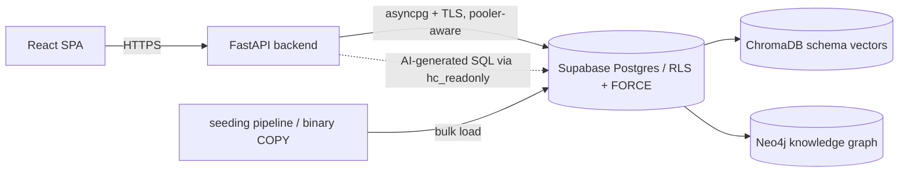

# Technical Architecture — Healthcare Copilot

Complete technical reference with Mermaid diagrams. Sections:

1. [System architecture](#1-system-architecture)
2. [Authentication flow](#2-authentication-flow)
3. [RAG flow](#3-rag-flow)
4. [SQL generation flow](#4-sql-generation-flow)
5. [Dashboard generation flow](#5-dashboard-generation-flow)
6. [WebSocket flow](#6-websocket-flow)
7. [Database schema](#7-database-schema)
8. [Security architecture](#8-security-architecture)
9. [Deployment architecture](#9-deployment-architecture)
10. [Backup & recovery architecture](#10-backup--recovery-architecture)

---

## 1. System architecture

A React SPA talks to an async FastAPI backend through an nginx edge. The backend
orchestrates an LLM, a RAG store (ChromaDB), a knowledge graph (Neo4j), and a
PostgreSQL warehouse — executing all AI-generated SQL through a **separate
read-only role**. Redis backs sessions/cache; Prometheus/Grafana/Jaeger provide
observability.



---

## 2. Authentication flow

PyJWT access/refresh tokens are delivered as **HttpOnly cookies** (invisible to
JS). Access tokens carry a `jti` for revocation; refresh tokens are **rotated**
on every use and the spent token is denylisted in Redis. Logout denylists both.

```mermaid
sequenceDiagram
    autonumber
    participant B as Browser (SPA)
    participant N as nginx
    participant API as FastAPI
    participant DB as PostgreSQL
    participant R as Redis

    B->>API: POST /auth/login (form: username, password)
    API->>DB: SELECT user; verify bcrypt hash
    API->>API: create access+refresh JWT (with jti)
    API-->>B: Set-Cookie access_token, refresh_token (HttpOnly, SameSite, Secure)

    Note over B,API: Subsequent requests send cookies automatically
    B->>API: GET /api/... (cookie)
    API->>API: verify_token (cookie or Bearer)
    API->>R: EXISTS jwt:denylist:{jti}?
    R-->>API: not revoked
    API->>DB: load active user
    API-->>B: 200 + data

    Note over B,API: On 401, SPA silently refreshes once
    B->>API: POST /auth/refresh (refresh cookie)
    API->>R: EXISTS denylist:{old jti}? (replay check)
    API->>R: SETEX denylist:{old jti} (rotate)
    API-->>B: new access+refresh cookies

    B->>API: POST /auth/logout
    API->>R: SETEX denylist:{access jti}, denylist:{refresh jti}
    API-->>B: clear cookies
```

**Authorization:** `RequireRole` / `get_current_admin` dependencies gate routes;
the user's role is also pushed into PostgreSQL session GUCs for RLS (see §8).

---

## 3. RAG flow

Two phases. **Indexing** (startup / `/rag/index`) extracts live schema and stores
three chunk types per table in ChromaDB, skipping unchanged tables by hash.
**Retrieval** uses **HyDE** (generate a hypothetical SQL doc), embeds it,
over-fetches, re-ranks by table, and assembles a structured schema context.



---

## 4. SQL generation flow

The default `/chat/query` pipeline and the streaming `/chat/query-agentic`
(LangGraph) pipeline both converge on the **same safety gate**: validation →
read-only execution → PHI redaction. Invalid or unauthorized SQL never executes.



**Validation engine checks:** single `SELECT`/`WITH` only; table allow-list
(12 clinical tables; `users`/`audit_logs`/`copilot_*` denied); blocked DML/DDL
keywords (AST + comment/string-stripped regex); system-catalog block; stacked /
tautology / null-byte injection; complexity score ≤ 30; mandatory `LIMIT`.

---

## 5. Dashboard generation flow

One natural-language request fans out into 3–5 focused panels, each run through
the full NL→SQL→validate→read-only-exec→redact→chart pipeline **in parallel**,
then composed into a laid-out dashboard with an LLM executive summary.



---

## 6. WebSocket flow

The streaming query socket authenticates from the **HttpOnly cookie** on the
handshake, then streams each pipeline stage as a discrete event. The realtime
analytics socket broadcasts Kafka-sourced clinical events to authenticated clients.

```mermaid
sequenceDiagram
    autonumber
    participant B as Browser
    participant API as FastAPI WS
    participant R as RAG
    participant L as LLM
    participant V as Validator
    participant DB as Read-only PG

    B->>API: WS connect /api/v1/stream/{session} (cookie)
    API->>API: verify_token (cookie); reject 4001 if invalid
    B->>API: { question }
    API-->>B: status: retrieving_schema
    API->>R: retrieve schema context
    API-->>B: status: generating_sql
    API->>L: generate SQL
    API-->>B: sql_generated
    API->>V: validate (legacy 3-tuple)
    API-->>B: sql_validated { valid, violations }
    alt valid
        API->>DB: execute (read-only, role GUC)
        API->>API: PHI redaction by role
        API-->>B: results_ready
        API-->>B: chart_ready
        API-->>B: insights_ready
        API-->>B: done
    else invalid
        API-->>B: done { error: validation failed }
    end
```

---

## 7. Database schema

UUID PKs, timezone-aware audit timestamps, and an OLAP-style clinical star around
`patients` / `encounters`. Auth/copilot/audit tables are isolated from the
analytics allow-list. (Abbreviated; see `backend/app/db/models/`.)



**Migrations (Alembic, linear):** `001` base schema → `73684e…` audit + roles →
`5222b9…` alerts → `a1b2c3…` FK/date indexes → `b2c3d4…` **RLS policies** →
`c3d4e5…` **PHI encryption** column widening.

---

## 8. Security architecture

Defense in depth — seven enforcement layers from the network edge down to the row.





---

## 9. Deployment architecture

Production runs behind a load balancer that terminates TLS; the nginx frontend
serves the SPA and reverse-proxies `/api` + `/ws`. Migrations run as a one-shot
job before the API starts. Datastores are private; the read-only role targets a
read replica.



Scaling: backend is stateless → horizontal autoscale; add **PgBouncer** in front
of Postgres; route `hc_readonly` to the replica; managed Redis/vector DB. See
[DEPLOYMENT.md](DEPLOYMENT.md).

---

## 10. Backup & recovery architecture

Automated, checksummed, custom-format `pg_dump` on a schedule, replicated
offsite, and — critically — **test-restored automatically**. Encryption keys are
backed up separately from the database (a DB restore is useless without them).



**Targets:** RTO ≤ 1h, RPO ≤ 24h (≤ 5 min with WAL/PITR). Derived stores
(ChromaDB, Neo4j) rebuild from Postgres on startup and are excluded from RPO.
Full runbook: [DISASTER_RECOVERY.md](DISASTER_RECOVERY.md).

---

## Supabase data platform

The primary datastore can run on **Supabase** (managed PostgreSQL) with no change
to the application model — Supabase *is* Postgres, so SQLAlchemy/Alembic, RLS, the
read-only executor role, and Fernet PHI encryption all carry over.



- **Connection:** `SUPABASE_DB_URL` (session or transaction pooler). The backend
  auto-enables TLS for `*.supabase.*` and, on the transaction pooler (`:6543`),
  disables prepared-statement caching (`Settings.asyncpg_connect_args`). Startup
  retries through pooler cold starts (`db.session.wait_for_database`).
- **Schema parity:** `supabase/migration.sql` is auto-generated from the ORM
  (`scripts/emit_supabase_sql.py`) and matches `alembic upgrade head` exactly.
- **Data:** the `seeding/` pipeline streams a 100K-patient / ~6.6M-row synthetic
  dataset via COPY. See [SUPABASE_SETUP.md](SUPABASE_SETUP.md),
  [DATA_GENERATION.md](DATA_GENERATION.md), [DATABASE_SCHEMA.md](DATABASE_SCHEMA.md),
  and [SAMPLE_QUERIES.md](SAMPLE_QUERIES.md).
