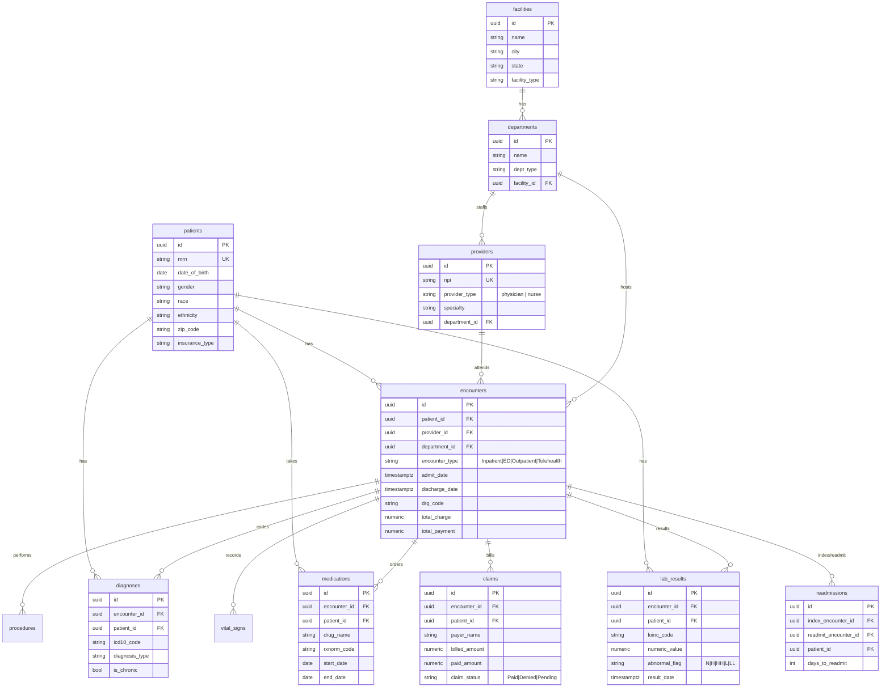

# Database Schema

PostgreSQL / Supabase. 19 tables: **12 clinical/reference** (queryable by the
copilot), **7 application/system** (auth, audit, copilot, alerts — never exposed
to AI-generated SQL). UUID primary keys, `created_at`/`updated_at` everywhere.

## Entity-Relationship diagram (clinical core)

(`procedures` and `vital_signs` follow the same encounter/patient pattern; omitted
above for readability.)

## Tables

### Clinical & reference (12 — copilot-queryable; on the SQL allow-list)
| Table | Grain | Key columns |
|---|---|---|
| `facilities` | one row per hospital/clinic/lab | `name, city, state, facility_type` |
| `departments` | dept within a facility | `name, dept_type, facility_id` |
| `providers` | clinician | `npi, provider_type, specialty, department_id` |
| `patients` | patient master | `mrn, date_of_birth, gender, race, ethnicity, zip_code, insurance_type` |
| `encounters` | visit / "appointment" | `encounter_type, admit_date, discharge_date, drg_code, total_charge, total_payment` |
| `diagnoses` | ICD-10 per encounter | `icd10_code, diagnosis_type, is_chronic` |
| `procedures` | CPT per encounter | `cpt_code, charge_amount` |
| `medications` | order / "prescription" | `drug_name, rxnorm_code, start_date, end_date` |
| `lab_results` | LOINC result | `loinc_code, numeric_value, abnormal_flag, result_date` |
| `vital_signs` | vitals reading | `systolic_bp, heart_rate, temperature_f, spo2_pct` |
| `claims` | insurance claim | `payer_name, billed_amount, paid_amount, claim_status` |
| `readmissions` | 30-day readmit link | `index_encounter_id, readmit_encounter_id, days_to_readmit` |

### Application / system (7 — NOT exposed to AI-generated SQL)
`users` (RBAC; `first_name`/`last_name` Fernet-encrypted at rest),
`audit_logs`, `copilot_sessions`, `copilot_messages`, `nl_sql_pairs`,
`schema_registry`, `alerts`.

## Security controls on the schema
- **Row-Level Security** (`ENABLE` + `FORCE`) on all clinical tables. Policy pair
  per table: `*_trusted` (no `app.current_user_role` GUC → trusted backend, full
  access) and `*_role_read` (GUC set → role-gated `SELECT` only). `claims` is
  restricted to `admin`/`analyst`.
- **Least-privilege role** `hc_readonly` executes AI-generated SQL: `SELECT` on
  the 12 clinical/reference tables only; no access to `users`/`audit_logs`/
  `copilot_*`.
- **PHI encryption at rest:** `users.first_name/last_name` stored as `TEXT`
  Fernet ciphertext via the `EncryptedString` type.

Regenerate the Supabase DDL from these models any time:
`python backend/scripts/emit_supabase_sql.py` → `supabase/{migration,rollback,rls_policies}.sql`.
